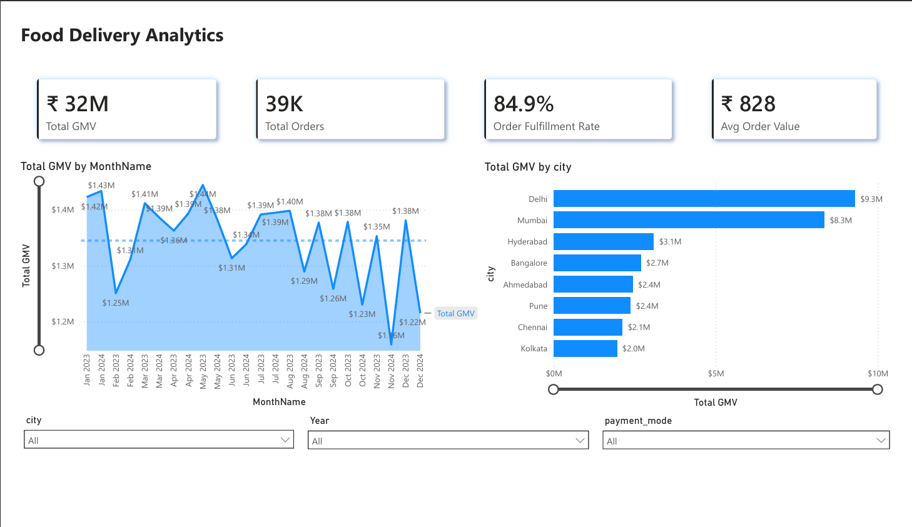
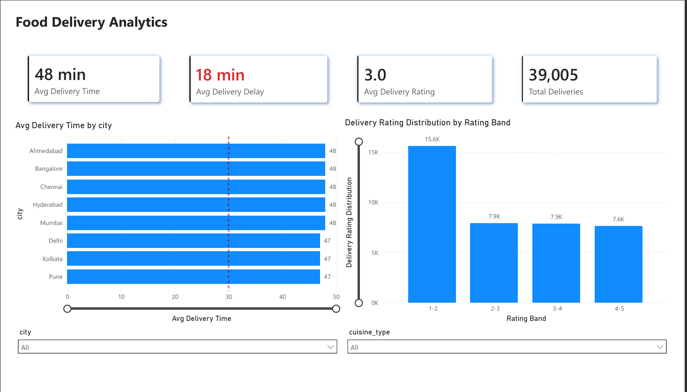
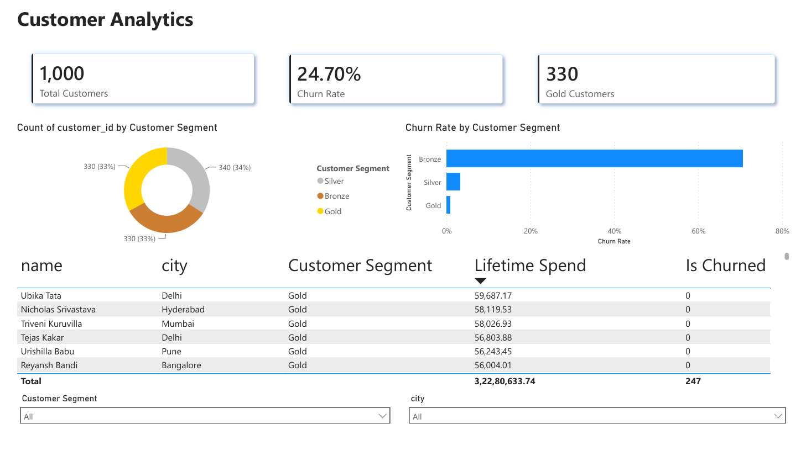
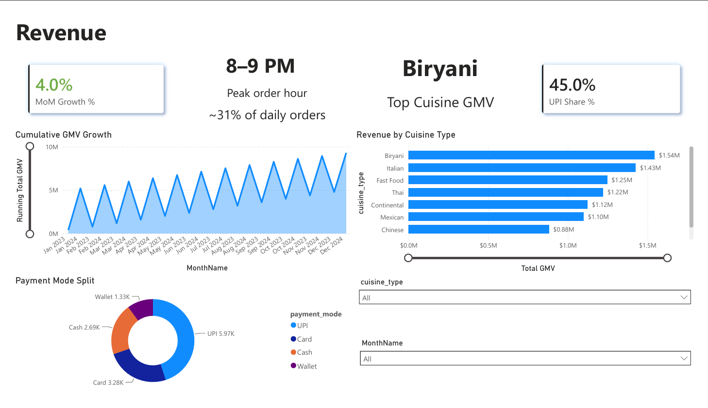

# Food Delivery Analytics System | SQL Server, Power BI, Python

An end-to-end data analytics project built to simulate a Zomato/Swiggy-style food delivery platform. I designed the database schema from scratch, generated realistic synthetic data, wrote business SQL queries, ran a Python cohort analysis, and built a 4-page interactive Power BI dashboard.

---

## Dashboard Snapshots

### Page 1 — Executive Summary


### Page 2 — Delivery Performance


### Page 3 — Customer Analytics


### Page 4 — Revenue Deep Dive


---

## Problem Statement

I wanted to work on a project that felt close to what data analysts actually do in a product company — so instead of using a flat Kaggle CSV, I built a relational database from scratch with 5 linked tables, generated realistic Indian food delivery data, and analysed it end-to-end.

The dashboard helps answer real business questions: which cities drive the most revenue, when do orders peak, why are customers churning, and which customer segments are most valuable. These are the kinds of questions a data analyst at Swiggy or Zomato would be expected to answer.

---

## Dataset

I generated all the data myself using Python (Faker + random) because real food delivery datasets on Kaggle don't have the proper relational structure with foreign key constraints. Building it from scratch also gave me full control over the data patterns.

| Table | Rows | Description |
|---|---|---|
| `customers` | 1,000 | Indian names, emails, cities, signup dates |
| `restaurants` | 150 | Cuisine types, cities, ratings, active status |
| `orders` | 50,000 | Jan 2023 – Dec 2024, statuses, payment modes |
| `order_items` | ~150,000 | Dish names, quantities, unit prices |
| `delivery` | ~39,000 | Pickup/delivery times, rider IDs, ratings |
| **Total** | **~244,000+** | |

I added intentional patterns to make the data realistic:
- Mumbai and Delhi weighted higher in customer distribution → top-2 cities contribute ~54% of GMV
- Hour weights peak at 8–9 PM → dinner rush drives ~31% of daily orders
- UPI weighted at 45% → reflects Indian digital payment behaviour
- Churned customers given a 60-day order silence window

---

## Project Structure

```
food-delivery-analytics/
│
├── sql/
│   ├── 01_create_schema.sql          ← 5-table schema with FK constraints
│   └── 02_all_15_queries.sql         ← 15 business SQL queries
│
├── notebooks/
│   ├── insert_mock_data.ipynb        ← Data generation + SQL Server ETL pipeline
│   └── cohort_analysis.ipynb         ← Python churn + cohort retention analysis
│
├── powerbi/
│   └── food_delivery_dashboard.pbix  ← 4-page interactive Power BI dashboard
│
├── screenshots/
│   ├── powerbi_page1_executive_summary.png
│   ├── powerbi_page2_delivery.png
│   ├── powerbi_page3_customers.png
│   └── powerbi_page4_revenue.png
│
└── README.md
```

---

## Steps Followed

- **Step 1** — Designed a 5-table relational schema in SQL Server with primary keys, foreign key constraints, and proper data types for each entity (customers, restaurants, orders, order_items, delivery).

- **Step 2** — Generated 244,000+ synthetic records in Python using Faker with the `en_IN` locale for realistic Indian names, emails and phone numbers. Used weighted random sampling to bake in real business patterns — city-level GMV distribution, dinner peak hours, and UPI payment dominance.

- **Step 3** — Loaded all 5 tables into SQL Server via a SQLAlchemy ETL pipeline in the correct FK-safe order: customers and restaurants first, then orders, then order_items and delivery. Used `fast_executemany=True` for faster bulk inserts.

- **Step 4** — Wrote 15 SQL queries in SSMS covering revenue analysis, customer behaviour, delivery performance, and churn. Used window functions like `RANK()`, `LAG()`, and `NTILE()` along with CTEs for the more complex queries.

- **Step 5** — Ran a Python cohort analysis in Jupyter by pulling data directly from SQL Server using SQLAlchemy. Calculated churn rate using a 60-day silence rule, segmented customers into Gold/Silver/Bronze tiers using `pd.qcut()`, built a monthly cohort retention heatmap, and pulled out high-value churned customers for re-engagement targeting.

- **Step 6** — Built a 4-page Power BI dashboard connected to SQL Server. Created a DateTable for time-intelligence support, added calculated columns for customer segmentation and churn status, and wrote DAX measures for all KPIs. One challenge I ran into: Power BI was failing to join DateTable to orders because `order_date` stores `DATETIME` (with time) while DateTable stores date-only values — I fixed this by adding an `order_date_only` calculated column that strips the time component.

- **Step 7** — Added slicers and synced the City slicer across all 4 pages using Power BI's Sync Slicers panel so filtering by city updates everything at once.

---

## SQL Queries

15 queries written in SQL Server covering different business questions:

| # | Query | Technique Used |
|---|---|---|
| Q1 | Total Revenue and Orders Per City | GROUP BY, JOIN |
| Q2 | Top 5 Most Ordered Dishes | GROUP BY, TOP |
| Q3 | Restaurants With Low Delivery Rating | HAVING, AVG |
| Q4 | Monthly Order Count and Revenue Trend | DATEPART, GROUP BY |
| Q5 | Customers Who Never Placed an Order | LEFT JOIN, IS NULL |
| Q6 | Repeat Customers — 3+ Orders in 30 Days | DATEADD, HAVING |
| Q7 | Average Delivery Time by City | AVG, MIN, MAX |
| Q8 | Revenue Contribution % by Cuisine | Subquery percentage |
| Q9 | Orders Above City Average Value | Correlated subquery |
| Q10 | Peak Order Hours | DATEPART(HOUR), % of daily orders |
| Q11 | Rank Restaurants by Revenue Within City | `RANK() OVER (PARTITION BY city)` |
| Q12 | Month-over-Month Revenue Growth | `LAG() OVER (ORDER BY yr, mn)` |
| Q13 | Churned Customers (No Order in 60 Days) | CTE, DATEDIFF |
| Q14 | Running Total Revenue Per City by Month | `SUM() OVER (PARTITION BY city ORDER BY yr, mn)` |
| Q15 | Customer Segmentation — Gold/Silver/Bronze | `NTILE(3) OVER (ORDER BY SUM(...))` |

---

## DAX Measures (Power BI)

| Measure | What it does |
|---|---|
| Total GMV | Sum of total_amount for Delivered orders only |
| Total Orders | Count of Delivered order_ids |
| Avg Order Value | Total GMV ÷ Total Orders |
| Order Fulfillment Rate | Delivered orders ÷ all orders placed |
| Revenue Prev Month | CALCULATE with DATEADD(-1, MONTH) |
| MoM Growth % | (Current − Prev Month GMV) ÷ Prev Month GMV |
| Avg Delivery Time | ROUND(AVERAGE(delivery_minutes), 0) |
| Avg Delivery Delay | Avg Delivery Time − 30 min benchmark |
| Churn Rate | Customers with Is Churned = 1 ÷ total customers |
| Running Total GMV | Cumulative GMV using ALL(DateTable) filter |
| UPI Share % | UPI orders ÷ all orders |

I also added these calculated columns:

| Column | Table | What it does |
|---|---|---|
| order_date_only | orders | Date-only version of order_date to fix DateTable join |
| Lifetime Spend | customers | Total delivered order value per customer |
| Customer Segment | customers | Gold/Silver/Bronze using PERCENTILEX.INC at P33 and P67 |
| Is Churned | customers | 1 if last order > 60 days before dataset end date |
| Rating Band | delivery | Groups ratings into 1–2, 2–3, 3–4, 4–5 bands |

---

## Key Findings

### Page 1 — Executive Summary
- Total GMV across 2023–2024: ₹3.2 Cr
- Order Fulfillment Rate: 84.9%
- Avg Order Value: ₹828
- Delhi (₹9.3M) + Mumbai (₹8.3M) together contribute ~54% of total platform GMV

### Page 2 — Delivery Performance
- Average delivery time is 48 minutes — 18 minutes above the 30-min benchmark
- Average delivery rating is 3.0 / 5.0
- Rating distribution is heavily skewed towards low ratings — 15.6K deliveries rated 1–2 vs 7.6K rated 4–5

### Page 3 — Customer Analytics
- 24.7% of customers have churned (no delivered order in 60+ days)
- Customers are split evenly into tiers: 330 Gold, 340 Silver, 330 Bronze
- Bronze customers churn at a significantly higher rate than Gold customers — confirmed by both the Power BI dashboard and the Python cohort notebook

### Page 4 — Revenue Deep Dive
- MoM revenue growth averages ~4% across the 2-year period
- 8–9 PM is the peak order window, accounting for ~31% of daily delivered orders
- Top cuisine by GMV: Biryani (₹1.54M) followed by Italian (₹1.43M)
- UPI is the dominant payment mode at 45.0%, followed by Card (24.7%), Cash (20.2%), Wallet (10.1%)

---

## Python Cohort Analysis

The `cohort_analysis.ipynb` notebook connects to SQL Server and runs:

- **Churn analysis** — flags customers with no order in 60+ days using the dataset's own max order date (not real-world today) so the threshold is meaningful
- **Tier segmentation** — divides customers into Gold/Silver/Bronze using `pd.qcut()` on lifetime spend
- **Cohort retention heatmap** — monthly retention matrix showing what % of each signup cohort is still ordering month-by-month
- **Re-engagement list** — pulls churned customers in the top 25% by lifetime spend as priority win-back targets

---

## Tech Stack

| Tool | Purpose |
|---|---|
| Python (Faker, Pandas) | Synthetic data generation |
| SQLAlchemy + pyodbc | ETL pipeline — Python to SQL Server |
| SQL Server + SSMS | Database — 5 tables, 15 analytical queries |
| Matplotlib, Seaborn | Cohort heatmap, churn distribution charts |
| Power BI Desktop | 4-page dashboard with 11 DAX measures |
| Git + GitHub | Version control |

---

## How to Run

1. Open SSMS → create database `food_delivery_db` → run `01_create_schema.sql`
2. Open `insert_mock_data.ipynb` → change `SERVER` to your SQL Server instance name → Run All Cells
3. Open `02_all_15_queries.sql` in SSMS → run each query block one at a time
4. Open `cohort_analysis.ipynb` → change `SERVER` name → Run All Cells
5. Open `food_delivery_dashboard.pbix` in Power BI Desktop → click Refresh
